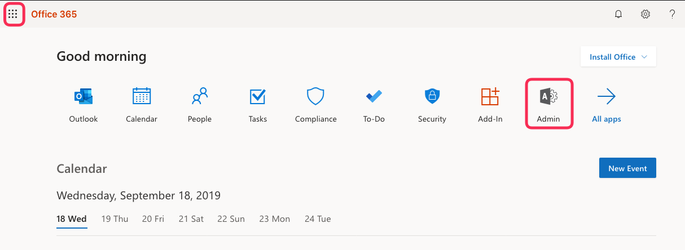
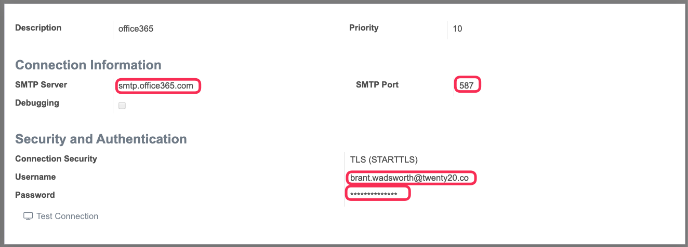
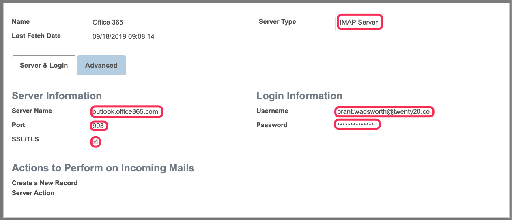

:banner: banners/accounting.jpg

================
Email Setup
================

Microsoft Office 365
--------------------

IMPORTANT
+++++++++++++

- Twenty20 is trying to operate as a relay server. Meaning that it is used as an middle layer to send emails from ANY mail address to ANY mail addresss

- The customer needs to have a dedicated email address setup for Twenty20.

- Twenty20 uses email aliases to send and receive email. An alias is a way to disguise the original email address, through which communication is passing. It enables the system to send an email using the alias of the email rather than original email address of the recipient. For example, brant.wadsworth@twenty20.co will be sent using t20@twenty20.co.

Create Office 365 dedicated email for Twenty20
++++++++++++++++++++++++++++++++++++++++++++++

1. Login to **customer**  Microsoft Account using an administrator acoount at   https://portal.office.com

2. Select the app launcher icon in the top left corner and select the "Admin" icon as indicated below

3. Click Users -> Active Users in the left side menu. The customer needs to create a dedicated user for their Twenty20 system. This should correspond to the outgoing email setup in Twenty20

.. image:: media/ms-user-mgmt.png
    :align: center

4. Add a new user to the customer's account that will be dedicated to Twenty20.

Setup Twenty20 Outgoing Server
+++++++++++++++++++++++++++++++

1. Activate the **Developer Mode**

2. Go to Settings > Technical > Email > Outgoing Mail Servers.

3. Open any existing record or create a new one with the following configuration:

.. Note::

    - Description: Office 365 Outgoing Mail Server
    - SMTP Server: smtp.office365.com
    - Connection Security: TLS (STARTTLS)
    - Username: [username from the account created above]
    - Password: [password form the account created above]
    - SMTP Port: 587

4. Click on **test connection** to verify that your setup is correct.
5. Go to user preferences by clicking on user name on the upper-right corner and click on Preferences from the dropdown. Then write the same email address which you configured for an outgoing mail address as below screenshot:

Your outgoing email server should now be configured correctly.

.. Note::
 It is possible that email can not be sent successfulyl at this time because of configurations that must take place on the customer's exchange server.
 The instructions follow.

Alias Configuration in Twenty20
+++++++++++++++++++++++++++++++++++++++++++++++++++++++++

It is import that each user be setup with an email alias.
This ensures that email that is sent by a particular user will have their proper email address and not the address that was setup for the Twenty20 system.

1. Go to user preferences by clicking on user name on the upper-right corner and click on Preferences from the dropdown.
Update the email address with the alias - which should be the users "Real" email address.

Now, if you send an email from Twenty20, it will display the alias of the email instead of the actual email that it uses to send and was configured in the outgoing email server.

Incoming Server
+++++++++++++++++++

1. Activate the **Developer Mode**

2. Go to Settings -> Technical -> Email -> Incoming Mail Servers.

3. Open any existing record or create a new one with the following configuration:

.. Note::

    - Description: Office 365 Incoming Mail Server
    - Server Type: IMAP Server
    - Server Name: outlook.office365.com
    - Port: 993
    - SSL/TLS: True
    - Username: yourname@domain.onmicrosoft.com
    - Password: Office 365 mail server password

4. Click on “Test & Confirm” button to verify configuration.
5. Go to Incoming Mail Servers from step 2 and click on “Fetch Now” button. It will fetch the mail.

Configure Office 365 as Relay server
++++++++++++++++++++++++++++++++++++++

1. Login with your Global Admin user account to https://portal.office.com/adminportal/home and click on the “Admin Center -> Exchange” menu in the left panel
2. In the Opened Window click on the section “mail flow -> connectors”
3. Click the “plus” sign on the opened page to add a new connector
4. On the first screen with mail flow scenario, select the following values and click “Next”

- From = “Your organization’s email server”
- To = “Office 365”

5. Give a name to the connector. E.g. “Twenty20 Connector”. All checkboxes should be checked (default behavior). And click Next
6. Select checkbox to verify allowed senders by IP address and add IP addresses of twenty20. That is a type of whitelist. Office 365 will trust messages sent from those IP addresses as safe.
7. After clicking “Save” you should get the following screen with an already created connector

Office 365’s outgoing mail server is now configured and ready to be used with Twenty20. But before proceeding to Twenty20 configuration, let’s make Office 365 ready to receive incoming mails for Twenty20. This is described in next step.

Configure catchall email in Office 365
++++++++++++++++++++++++++++++++++++++